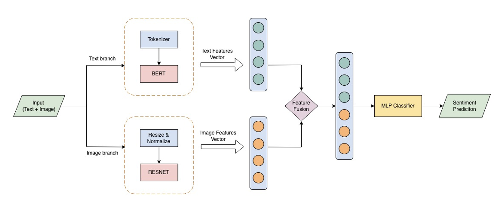

# Multimodal Sentiment Analysis

## 1. Introduction

Multimodal Sentiment Analysis aims to understand and predict human
sentiment by leveraging multiple data modalities such as text and
images. Unlike traditional sentiment analysis that relies solely on
textual data, this approach combines visual and textual information to
capture richer contextual signals.

This project focuses on building a machine learning/deep learning
pipeline to classify sentiment based on multimodal inputs. The system
can be applied in various real-world scenarios such as social media
analysis, product reviews, and customer feedback systems.

### Objectives

-   Build a complete data processing pipeline for multimodal data
-   Train and evaluate machine learning / deep learning models
-   Combine text and image features effectively
-   Deploy a demo system for inference on new data
-   Compare model performance using appropriate evaluation metrics

------------------------------------------------------------------------

## 2. Dataset

### Data Source

-   Dataset: MVSA (Multimodal Sentiment Analysis Dataset)
-   Source: Kaggle
-   Link: https://www.kaggle.com/datasets/vincemarcs/mvsamultiple/data

### Data Description

The dataset contains samples with both image and text information,
labeled with sentiment classes.

  Column   Type         Description
  -------- ------------ ----------------------------
  image    image file   Visual content
  text     string       Caption or associated text
  label    string       Sentiment label

### Sentiment Classes

-   Positive
-   Neutral
-   Negative

------------------------------------------------------------------------

## 3. System Pipeline

### 3.1 Data Preprocessing

-   Clean and normalize text data
-   Tokenization and embedding
-   Image preprocessing (resize, normalization)
-   Handle missing or corrupted data

### 3.2 Feature Extraction

-   Text features: pretrained language models
-   Image features: CNN / ViT
-   Feature fusion

### 3.3 Model Training

-   Train / validation / test split
-   Model training and optimization

### 3.4 Evaluation

-   Evaluate model performance

### 3.5 Inference / Demo

-   Predict sentiment on new data

------------------------------------------------------------------------

## 4. Model Architecture

### Baseline Multimodal Model

<p align="center">
  
</p>

------------------------------------------------------------------------

## 5. Results

### Evaluation Metrics

-   Accuracy
-   Precision
-   Recall
-   F1-score

### Experimental Results

  Model        Accuracy   Precision   Recall   F1-score
  ------------ ---------- ----------- -------- ----------
  Text-only                                    
  Image-only                                   
  Multimodal                                                          

------------------------------------------------------------------------

## 6. Setup

### Installation

``` bash
git clone <your-repo>
cd <project>
pip install -r requirements.txt
```

### Training

``` bash
python train.py
```

### Prediction

``` bash
python predict.py
```

------------------------------------------------------------------------

## Author

-   Nguyen Van Dat
-   12423061
